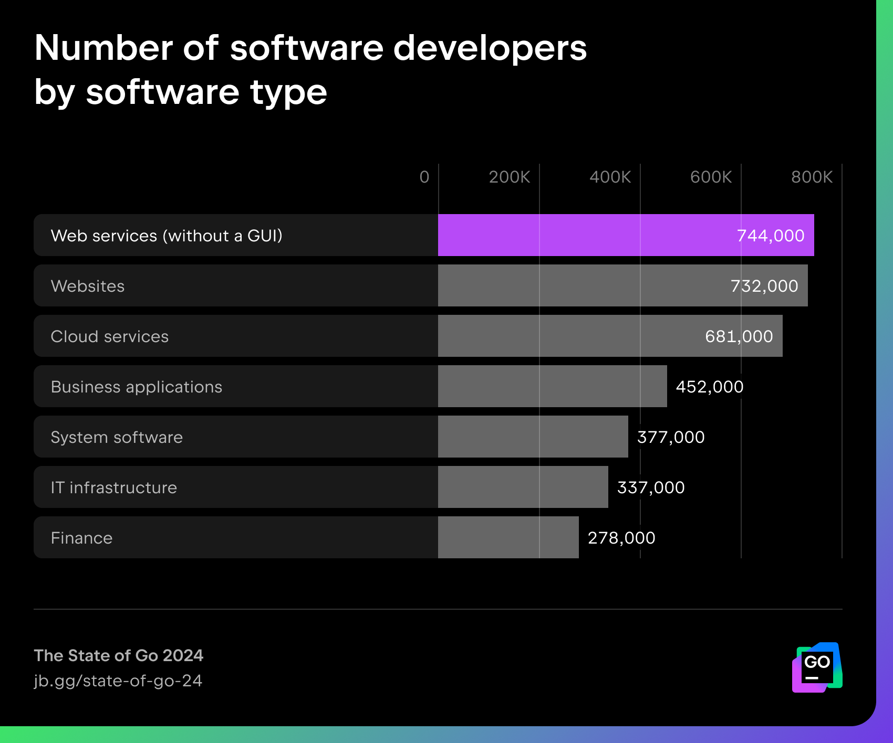
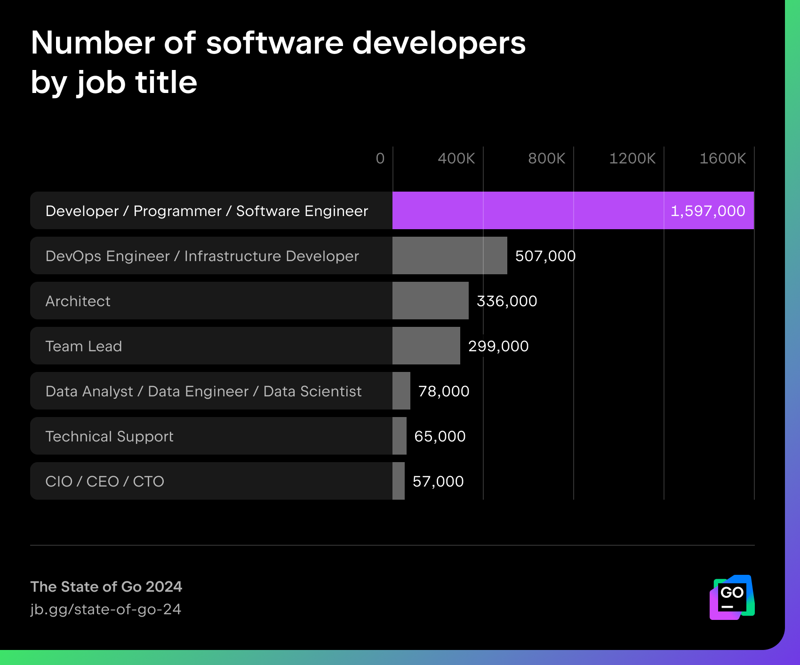
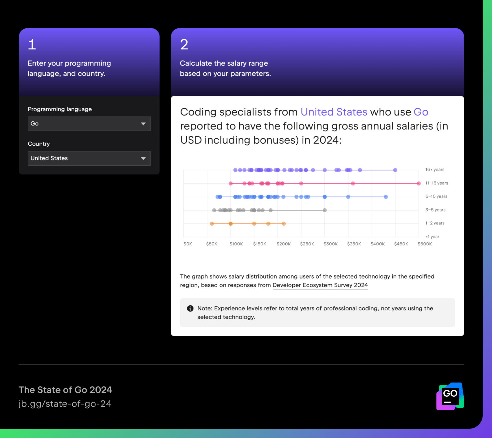
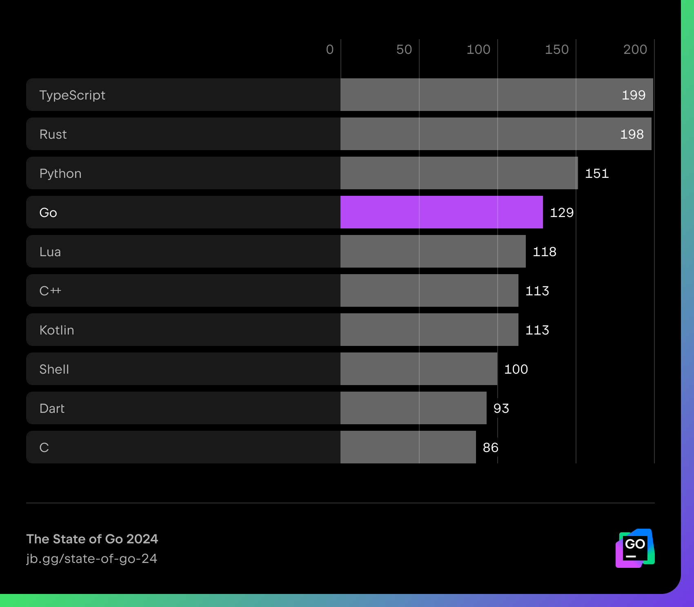
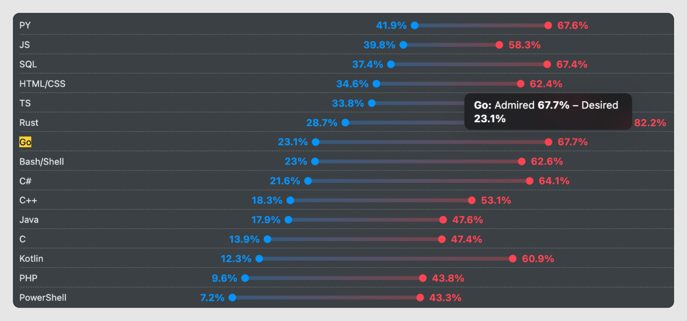
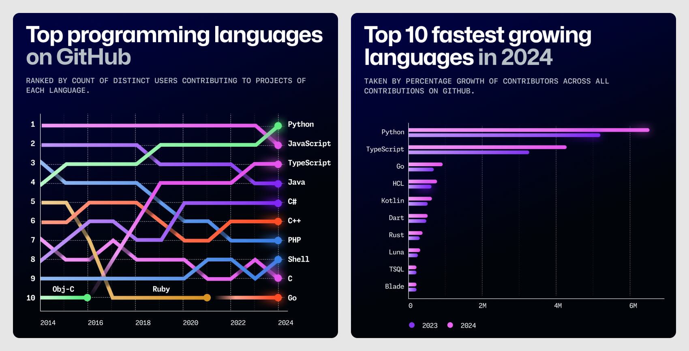
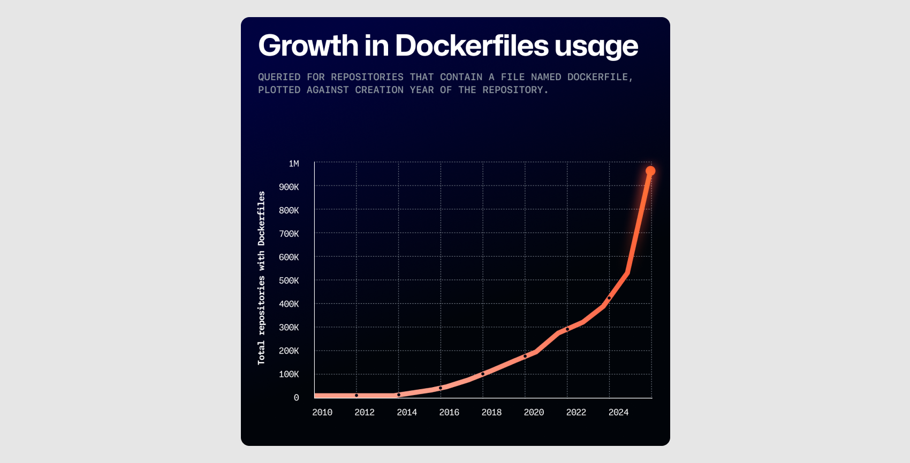
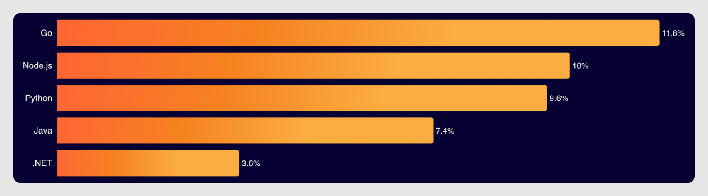
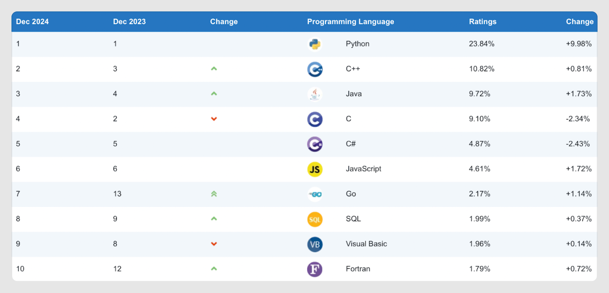

As a fast-growing language with a wide range of applications, Go has become increasingly relevant to both new and existing developers. In this blog post, we will share our overview of the current state of Go, its position in the programming landscape, and the strategies for the future of Go. Following an analysis of its market composition and user profile, we will then explore whether Go is still popular and dive into its future evolution.

How popular is Golang in 2024? Explore adoption trends, usage stats, and expert insights on Go’s future in backend development.

## The market for Go

According to the Developer Ecosystem Data Playground, the mean estimate is that 4.1 million Go professionals used Go within the last 12 months, and 1.8 million used it as one of their primary programming languages. According to the SlashData report for Q1 2024, at the beginning of 2024, there were around 4.7 million Go developers worldwide. While these two estimates are close, JetBrains’ figure only includes professionals who earn money (full-time, part-time employed, or freelancers; job roles that include coding duties like Developer, QA, DBA, etc.), whileSlashData also counts STEM students and hobbyists.
And Go’s usage must have grown significantly since then. In his talk from August 2024, Go Language PM Cameron Balahan mentions the number 5.8 million, based on the proportion of respondents who reported using Go on Stack Overflow's latest annual survey and SlashData’s estimate of the number of developers worldwide.

## Go developers

In 2024, as the **mainstream cloud market** continues to grow, there are two main categories of professional Go developers according to the [Developer Ecosystem: Data Playground](https://www.jetbrains.com/lp/devecosystem-data-playground/)

- Professionals who work on web services (744,000), websites (732,000), or business applications (452,000) that are fully or partially composed of microservices written in Go (e.g. routers, proxies, and data transformation services) that help to operate the necessary logic.
- Professionals who manage cloud services (681,000) or internal IT infrastructure (337,000) platforms (IaaS), which often consist of Kubernetes cluster operators, related Go web microservices, and CLI utilities. They also work on infrastructure as code (e.g. Terraform) and service support.

They often identify either as **Developers / Programmers / Software Engineers, or DevOps Engineers / Infrastructure Developers**:

Most are software engineering professionals, but the proportion of DevOps engineers and infrastructure developers is also significant, outlining a huge demand for cloud-native infrastructure and operations.

According to the Google Developer Survey 2024, similar to previous years, the most common **use cases for Go** remain **API/RPC services** (75%) and **command line tools** (62%).

The [Developer Ecosystem Survey 2024](https://www.jetbrains.com/lp/devecosystem-2024/#salary_group_share_by_language) and [StackOverflow Survey 2024](https://survey.stackoverflow.co/2024/work/#3-salary-and-experience-by-language) reveal that Go developers are among the **highest-paid in the industry**. [The average salary for Go developers](https://www.jetbrains.com/lp/devecosystem-2024/#pl_dynamics) is about $76,000 a year, while our [IT Salary Calculator](https://www.jetbrains.com/lp/devecosystem-it-salary-calculator/) reveals that Go developers in the United States can make up to $500,000 depending on their experience level.

The salaries of [SREs and cloud infrastructure engineers](https://survey.stackoverflow.co/2024/work/#3-salary-and-experience-by-developer-type) are also well above average.
Demand for Go developers is high and rising, as more and more companies move towards cloud-native architectures. However, there are not enough Go developers and DevOps or SRE professionals to meet this growing demand.

Go developers typically already have prior coding experience and often use multiple programming languages simultaneously. Most adopt Go for work purposes and learn it "by doing" – working with it in their own projects, reading code, and consulting the [Go documentation](https://go.dev/doc/) or basic tutorials like [A Tour of Go](https://go.dev/tour/welcome/1) or [Go by Example](https://gobyexample.com/), which are available online.

Finally, more than 80% of Go developers are [employed on a full-time basis](https://go.dev/blog/survey2024-h2-results#demographics) by a company or organization.

## Companies using Go

The main industries in which organizations with Go-heavy development operate have remained consistent over the past several years, according to the [Google Developer Surveys 2020](https://go.dev/blog/survey2020-results#who) and [2024](https://go.dev/blog/survey2024-h2-results#firmographics):

- **Technology** (Google, DataDog, K8s, HashiCorp, Cockroach, Dropbox, Salesforce, and Apple): >40%.
- **Financial services** (Monzo, American Express, Mercado Libre, and Moomoo Financial Singapore): 13%.
- **Transportation and retail services** (Amazon, Uber, Grabtaxi, DeliveryHero, and HelloFresh): 10%.
- **Media/gaming services** (Netflix, Bytedance, Tencent, Reddit, Mohalla, Snap, and Pinterest): 7%.

## How Go stacks up

In this section, we’ll look at where the Go programming language ranks in several prominent global programming language indices.

Because each ranking system draws on a variety of different data sources and methodologies, there is no single authoritative source that can provide a truly comprehensive overview of any programming language’s standing in the wider ecosystem. As such, we have collated the data from multiple rankings in order to give an accurate and objective reflection of Go’s position in the market compared to the other languages.

## JetBrains State of Developer Ecosystem Report: Language Promise Index

In the [JetBrains Language Promise Index](https://www.jetbrains.com/lp/devecosystem-2024/), which evaluates programming languages based on a combination of audience growth over the past five years, the stability of this growth, the percentage of people expressing an intention to adopt the language, and the proportion of its users who intend to switch to another language, **Go ranks fourth**.

It follows the undisputed leaders: **TypeScript**, **Rust**, and **Python**.

According to the **Developer Ecosystem Survey**, the programming languages most respondents plan to adopt are **Go** and **Rust**. While **Rust** continues to grow in popularity, the share of **Go** developers has remained stable.

## Stack Overflow 2024 Developer Survey: Admired and Desired

The [Admired and Desired](https://survey.stackoverflow.co/2024/technology#admired-and-desired) section of the Stack Overflow Developer Survey highlights which programming languages were most extensively used over the past year and which languages developers would like to use in the coming year.

In this ranking, **Go** surpassed **C#** and shell scripting languages, moving up from **ninth** to **seventh** place last year. Rust remains ahead of Go, with a significantly higher "Desired" rate and an even higher "Admired" rate.

## Github Octoverse: Operations and IaC

The **[GitHub Octoverse](https://github.blog/news-insights/octoverse/octoverse-2024/#the-most-popular-programming-languages) rankings** measure the activity of programming languages based on the number of open-source projects that use them.

In 2022, **Go** surpassed **Ruby** for the first time to join the ranks of the **GitHub Top 10 languages**. In 2024, its position remains stable. Although it is growing significantly slower than **Python** and **TypeScript**, **Go** is still among the **top three fastest-growing languages** in terms of open-source project activity.

Ever since cloud-native development exploded onto the scene in 2019, **infrastructure as code (IaC)** has enjoyed vigorous growth within the open-source ecosystem.

With **HCL**, **Go**, and **Dockerfiles** all increasing steadily in popularity, there’s clear evidence of an upward trend in cloud-native applications. Furthermore, the fast pace at which Terraform is being adopted by developers everywhere aligns with the growing use of Dockerfiles and other cloud-native technologies over the past decade.

## Cloudflare Radar 2024: API Client Language popularity

The [Cloudflare Radar](https://radar.cloudflare.com/year-in-review/2024#api-client-language-popularity) **Year in Review** highlights patterns and trends across the internet as observed through Cloudflare's global network.

Last year's most notable finding is that **Go** has **surpassed Node.js** as the most popular language for making automated API requests. [Go now tops the list](https://radar.cloudflare.com/year-in-review/2024#api-client-language-popularity), accounting for approximately [12%](https://radar.cloudflare.com/year-in-review/2024#api-client-language-popularity) of automated API requests made by Go-based clients, compared to [8.4%](https://radar.cloudflare.com/year-in-review/2023#api-client-language-popularity) last [year](https://radar.cloudflare.com/year-in-review/2023#api-client-language-popularity).

## TIOBE index

The [TIOBE Programming Language Index](https://www.tiobe.com/tiobe-index/) is recognized by many to be one of the world’s most prominent programming language rankings. It uses data from leading search engines relating to, and analyzing query volumes for specific programming languages and ranks them in order of popularity. However, recent fluctuations in the source data have made the TIOBE Index the subject of controversy of late, with many beginning to question its reliability.

That said, compared to 2023, **Go has risen from thirteenth to seventh position**, achieving its highest ranking since 2009.

## Summary

Based on the rankings above, last year, the **Go** programming language **remained in a stable state of development and even advanced** in several areas, including **usage for infrastructure as code (IaC), as well as for operations, API clients**, and **open-source projects**.

Moreover, Go is among the top three backend languages used in the [Apache Software Foundation’s](https://github.com/apache) projects, while the [Go subreddit's](https://www.reddit.com/r/golang/) popularity has been growing steadily since early 2024. The average daily number of posts has increased significantly compared to the previous two years, and many of them are from **developers, who recently started coding in Go**.

In this [blog post](https://tonybai.com/2025/01/06/the-2024-review-of-go-programming-language/), Tony Bai claims that Go is now entering its period of **maturity and a golden age**.

## Go and Rust

Although there’s an opinion that the rise of Rust could exert some pressure on Go, that’s not true. In their joint article [Rust vs. Go: Why They’re Better Together](https://thenewstack.io/rust-vs-go-why-theyre-better-together/), the Go and the Rust teams argue: _“While others may see Rust and Go as competitive programming languages, neither the Rust nor the Go teams do. Quite the contrary, our teams have deep respect for what the others are doing, and see the languages as complimentary with a shared vision of modernizing the state of software development industry-wide.”_

Go and Rust have a lot in common. Both are modern software languages designed with **performance** and **concurrency** in mind that natively support cross-compilation and come with **compiler safety guarantees**.

However, their primary use cases differ. Go is best suited for cloud server applications, web services, microservices, APIs, and CLI development, while Rust is ideal for performance-intensive, low-level embedded applications. Also, financial platforms are considering Rust for High-Frequency Trading.

Go has the advantage of being **easier to pick up** and more pleasant to work with, particularly for projects that need **rapid development and scalability**. On the other hand, Rust often appeals to **highly enthusiastic developers** and is favored for **certain performance-critical use cases**. As the article says, Rust is designed to enable you to squeeze every last drop of performance out of the code; however, Rust’s increased performance comes at the cost of additional complexity. Rust development is typically more **expensive and time-consuming**.

As a result, many companies use both **Rust and Go** to complement one another, employing Rust only in those scenarios where its benefits justify the additional cost. While it’s true that many Go developers are interested in experimenting with Rust, this does not indicate a decline in Go’s market share.

